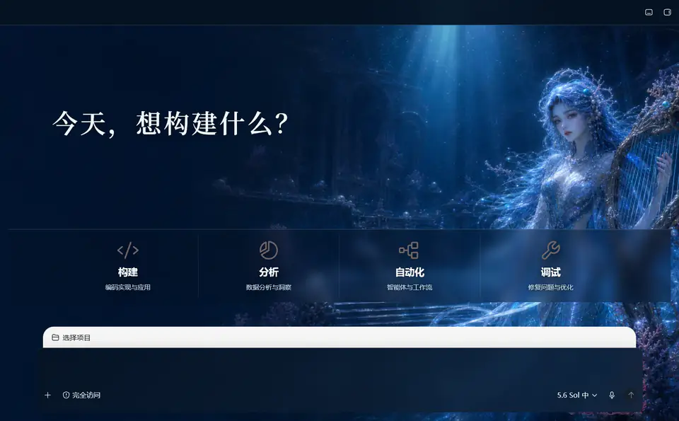

# Codex Theme Builder

一个可被 Codex 自动调用的 Codex Desktop 主题设计、开发、预览、验证与打包 Skill。

它不绑定某一种视觉风格。你可以给 Codex 一段文字需求、截图、设计稿或已有主题，Codex 会完成视觉方案、实现映射、主题开发、实时预览、视觉修正和最终打包。仓库内附带四套示例主题，并提供可扩展主题目录的侧栏切换器；新增主题只需遵循统一主题包结构并加入目录。

<table>
  <tr>
    <td width="50%"></td>
    <td width="50%"></td>
  </tr>
  <tr>
    <td align="center"><strong>墨境</strong> · 水墨山水、玉色选中标记、笔触输入框</td>
    <td align="center"><strong>雪魄剑仙</strong> · 冰雪画布、晶体前景输入框</td>
  </tr>
</table>

<table>
  <tr>
    <td width="50%"></td>
    <td width="50%"></td>
  </tr>
  <tr>
    <td align="center"><strong>沉歌剧院</strong> · 深海剧院、完整竖琴、深靛玻璃界面</td>
    <td align="center"><strong>潮汐圣歌</strong> · 珍珠水光、海洋歌姬、珍珠玻璃输入框</td>
  </tr>
</table>

> 四张图均为隐私安全、面向文档单独压缩的 WebP 展示图；不包含账户、项目或对话隐私，也不会让 README 加载完整运行时原图。

[查看完整主题与新增功能图鉴](docs/themes-and-features.md)

## 功能

- 根据文字、截图或设计稿生成可实现的主题方案。
- 自动搭建主题目录、清单、CSS、背景图和图标。
- 保留 Codex 原生菜单、输入框、项目选择、对话操作和输出面板功能。
- 支持首页与对话页使用不同背景。
- 支持选中、悬停、运行中、文件变更、弹窗和输出面板等状态。
- 支持侧栏内主题切换、选择记忆、失败回滚和键盘操作；无需重启 Codex。
- 桌面“万象”入口使用统一品牌启动面板：仅在 Codex 已运行时请求重启确认，随后按环境检查、Codex 启动、主题注入和验证等真实里程碑更新进度，确认达到 100% 后自动进入 Codex。
- 支持主题级输入框边缘素材：按左/右与上/下锚定、固定比例渲染，输入框变宽或变高时不会拉伸；主题切换后直接显示目标主题，不再叠加重复提示。
- 内置结构化新主题蓝图，覆盖全局画布、侧栏、首页、对话、选中态、输入框、输出面板、用量弹窗、主题切换和窄窗口验收。
- 在已启动的主题会话中热更新并截图验证。
- 检测清单、资源大小、SVG 安全性、JavaScript 语法与 CDP 安全边界。
- 打包主题为可分发 ZIP。
- Codex 更新后可重新验证并修复选择器兼容性。
- 运行时合并高频 DOM 变更、复用有效标记并限制昂贵扫描，在保留全部视觉效果的前提下降低长对话和侧栏滚动开销。

新增功能的界面截图、主题包组成和新主题需要覆盖的界面位置，统一记录在 [主题与功能图鉴](docs/themes-and-features.md) 中。开发边界与复用步骤见 [主题开发架构](docs/theme-development-architecture.md)，性能策略与测量结果见 [运行时性能](docs/runtime-performance.md)。

## 运行要求

- Windows 10/11
- Microsoft Store 版 Codex Desktop
- PowerShell 5.1 或更高版本
- Node.js 22 或更高版本

当前实时注入运行时面向 Windows。主题格式与设计流程是可复用的，但其他系统需要实现对应的安全启动运行时。

## 安装 Skill

推荐让 AI 或管理员执行完整自动配置：

```powershell
git clone https://github.com/Bob1837639921/codex-theme-builder.git
cd codex-theme-builder
powershell -ExecutionPolicy Bypass -File .\scripts\setup-windows.ps1
```

该脚本会自动验证内置主题和主题目录、安装或精确更新 Skill、核验 Node.js 与 Microsoft Store 版 Codex、生成「万象」图标，并在桌面创建直接调用隐藏 PowerShell 的主题快捷方式。配置结束后，用户只需保存当前内容、完全退出 Codex，再点击桌面快捷方式。启动后可在侧栏顶部的调色盘按钮中切换主题，选择会在后续任务和重启后保留。

在另一台 Windows 电脑上复刻时只需克隆同一仓库并运行上述 `setup-windows.ps1`。主题资源、切换运行时、中文启动提示、桌面快捷方式和 Skill 工作流都会从仓库安装，不依赖开发电脑上的临时目录或手工修改。

如果只需要安装 Skill，可以执行：

```powershell
powershell -ExecutionPolicy Bypass -File .\scripts\install-skill.ps1
```

脚本会把 `skills/codex-theme-builder` 复制到：

```text
%CODEX_HOME%\skills\codex-theme-builder
```

未设置 `CODEX_HOME` 时使用：

```text
%USERPROFILE%\.codex\skills\codex-theme-builder
```

安装后重新打开 Codex，使 Skill 出现在可用 Skills 中。若目标目录已存在，使用 `-Force`。内容完全一致时脚本不会重复复制；确有变化时，旧版本会备份到 `%LOCALAPPDATA%\CodexThemeBuilder\skill-backups`，不会在 Skills 列表中形成重复项。

## 让 Codex 全自动制作主题

在 Codex 中直接提出需求，例如：

```text
使用 $codex-theme-builder，根据我提供的截图设计一套简洁的玻璃拟态主题。
先生成可实现的设计方案，然后自动开发、热预览、修正并打包，不要停在设计图阶段。
```

或者让 Codex 自动选择视觉方向：

```text
使用 $codex-theme-builder，制作一套低饱和赛博风 Codex 主题。
你自行比较三个方向并选择最适合原生控件的方案，完成开发和视觉验收。
```

Skill 会先读取结构化新主题蓝图，把每个设计元素映射到原生 DOM、运行时标记或主题资产，逐项处理侧栏、首页、对话、输入框前景装饰、选中态、输出面板和弹窗对比度；它会拒绝无法安全实现的纯概念元素，并保留 `prefers-reduced-motion` 降级方案。

## 直接使用多主题运行时

先保存未发送内容并完全退出 Codex，然后执行：

```powershell
$skill = ".\skills\codex-theme-builder"
$theme = "$skill\assets\themes\ink-landscape"

powershell -ExecutionPolicy Bypass -File "$skill\scripts\start-theme.ps1" `
  -ThemePath $theme -ConfirmCodexClosed
```

启动后由隐藏的 Node.js 进程维持主题，不需要一直保留黑色控制台。运行时会读取相邻的 `theme-catalog.json` 并加载目录中列出的全部主题，侧栏调色盘负责即时切换。普通 Codex 快捷方式不会自动注入主题；Codex 更新或完全退出后，需要重新运行主题启动脚本或桌面主题快捷方式。

移除主题：

```powershell
powershell -ExecutionPolicy Bypass -File `
  ".\skills\codex-theme-builder\scripts\restore-theme.ps1"
```

## 常用命令

创建新主题：

```powershell
powershell -ExecutionPolicy Bypass -File `
  ".\skills\codex-theme-builder\scripts\new-theme.ps1" `
  -Id "my-theme" -Name "My Theme" `
  -HomeImage "C:\path\home.png" `
  -ConversationImage "C:\path\conversation.png" `
  -OutputDirectory ".\themes"
```

验证主题：

```powershell
powershell -ExecutionPolicy Bypass -File `
  ".\skills\codex-theme-builder\scripts\test-theme.ps1" `
  -ThemePath ".\themes\my-theme"
```

热预览并截图：

```powershell
powershell -ExecutionPolicy Bypass -File `
  ".\skills\codex-theme-builder\scripts\preview-theme.ps1" `
  -ThemePath ".\themes\my-theme" `
  -ScreenshotPath ".\qa\conversation.png"
```

打包主题：

```powershell
powershell -ExecutionPolicy Bypass -File `
  ".\skills\codex-theme-builder\scripts\package-theme.ps1" `
  -ThemePath ".\themes\my-theme" -OutputDirectory ".\dist"
```

## 安全设计

- 不修改 `app.asar`、WindowsApps、Codex 注册包或官方资源。
- 调试端口只绑定到本机回环地址。
- 验证 Microsoft Store 包身份、进程路径、端口所有者和 CDP 页面来源。
- 不会强制关闭 Codex；首次启动前必须由用户主动保存内容并退出。
- 只停止状态文件中可完整核验身份的主题注入进程。
- 主题样式限定在运行时根类下，尽量避免污染原生界面。

## 仓库结构

```text
.
├─ README.md
├─ docs/
│  ├─ images/                           # 经过体积约束的隐私安全 WebP 展示图
│  ├─ theme-development-architecture.md # 新主题的分层、界面契约和交付流程
│  ├─ runtime-performance.md            # 保留效果前提下的运行时性能策略
│  └─ themes-and-features.md            # 四套主题与界面能力图鉴
├─ scripts/
│  ├─ install-skill.ps1
│  └─ validate-repository.ps1
└─ skills/codex-theme-builder/
   ├─ SKILL.md
   ├─ agents/openai.yaml
   ├─ scripts/                         # 面向用户的创建、预览、验证、恢复与打包入口
   ├─ references/
   │  ├─ autonomous-workflow.md        # 自动化端到端工作流
   │  ├─ new-theme-blueprint.md        # 新主题必须覆盖的界面结构
   │  ├─ runtime-architecture.md       # 运行时分层、依赖方向与边界
   │  ├─ theme-contract.md             # 可移植主题包契约
   │  └─ windows-runtime.md            # Windows 安全启动与注入约束
   └─ assets/
      ├─ runtime/
      │  ├─ windows/scripts/
      │  │  ├─ common-windows.ps1      # Windows 进程、端口、路径与状态安全原语
      │  │  └─ config-utf8.ps1
      │  └─ v2/
      │     ├─ desktop-launch.ps1      # 桌面启动编排与顶层错误边界
      │     ├─ launch.ps1              # 启动核心与标准进度阶段
      │     ├─ restore.ps1             # 安全停止已核验的主题会话
      │     ├─ ui/launcher-ui.ps1      # 纯 WinForms 展示层
      │     ├─ scripts/injector.mjs     # CDP 验证、注入、重注入与主题目录加载
      │     ├─ assets/
      │     │  ├─ base.css             # 所有主题共享的结构样式
      │     │  └─ runtime.js            # DOM 标记、切换器与运行时交互
      │     └─ tests/run-tests.ps1      # 语法、安全、边界与视觉回归测试
      ├─ theme-template/theme.css       # 中性主题脚手架
      └─ themes/
         ├─ theme-catalog.json          # 可切换主题目录
         ├─ ink-landscape/              # 墨境示例主题（独立清单、样式与资源）
         ├─ frost-sword-immortal/       # 雪魄剑仙示例主题
         ├─ sunken-opera/               # 沉歌剧院：深色连续全局画布
         └─ tidal-hymn/                 # 潮汐圣歌：明亮连续全局画布
```

Skill 的自动工作流、主题格式和 QA 标准分别位于：

- `references/autonomous-workflow.md`
- `references/theme-contract.md`
- `references/runtime-architecture.md`
- `references/qa-checklist.md`
- `references/windows-runtime.md`

仓库级说明位于：

- [`docs/theme-development-architecture.md`](docs/theme-development-architecture.md)
- [`docs/runtime-performance.md`](docs/runtime-performance.md)
- [`docs/themes-and-features.md`](docs/themes-and-features.md)

## 验证仓库

```powershell
powershell -ExecutionPolicy Bypass -File .\scripts\validate-repository.ps1
```

该命令会验证 Skill 元数据、目录结构、PowerShell 语法、运行时 JavaScript、安全自检、主题目录以及目录中全部主题的完整载荷。
