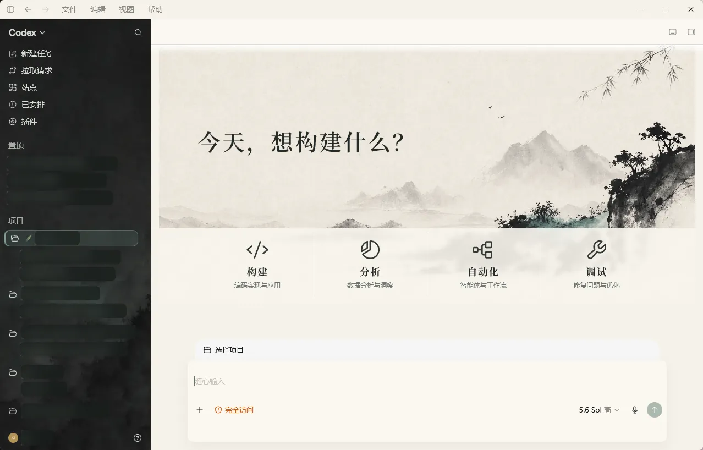

# Codex Theme Builder

一个可被 Codex 自动调用的 Codex Desktop 主题设计、开发、预览、验证与打包 Skill。

它不绑定某一种视觉风格。你可以给 Codex 一段文字需求、截图、设计稿或已有主题，Codex 会完成视觉方案、实现映射、主题开发、实时预览、视觉修正和最终打包。仓库内附带完整的「水墨山水」主题，既可以直接使用，也可以作为新主题的实现示例。



> 真实 Codex Desktop 运行截图；项目、任务和账户名称已做隐私隐藏。

## 功能

- 根据文字、截图或设计稿生成可实现的主题方案。
- 自动搭建主题目录、清单、CSS、背景图和图标。
- 保留 Codex 原生菜单、输入框、项目选择、对话操作和输出面板功能。
- 支持首页与对话页使用不同背景。
- 支持选中、悬停、运行中、文件变更、弹窗和输出面板等状态。
- 在已启动的主题会话中热更新并截图验证。
- 检测清单、资源大小、SVG 安全性、JavaScript 语法与 CDP 安全边界。
- 打包主题为可分发 ZIP。
- Codex 更新后可重新验证并修复选择器兼容性。

## 运行要求

- Windows 10/11
- Microsoft Store 版 Codex Desktop
- PowerShell 5.1 或更高版本
- Node.js 22 或更高版本

当前实时注入运行时面向 Windows。主题格式与设计流程是可复用的，但其他系统需要实现对应的安全启动运行时。

## 安装 Skill

推荐让 AI 或管理员执行完整自动配置：

```powershell
git clone https://github.com/Bob1837639921/codex-theme-builder.git
cd codex-theme-builder
powershell -ExecutionPolicy Bypass -File .\scripts\setup-windows.ps1
```

该脚本会自动验证仓库、安装或更新 Skill、核验 Node.js 与 Microsoft Store 版 Codex、生成主题图标，并在桌面创建直接调用隐藏 PowerShell 的主题快捷方式。配置结束后，用户只需保存当前内容、完全退出 Codex，再点击桌面快捷方式。

如果只需要安装 Skill，可以执行：

```powershell
powershell -ExecutionPolicy Bypass -File .\scripts\install-skill.ps1
```

脚本会把 `skills/codex-theme-builder` 复制到：

```text
%CODEX_HOME%\skills\codex-theme-builder
```

未设置 `CODEX_HOME` 时使用：

```text
%USERPROFILE%\.codex\skills\codex-theme-builder
```

安装后重新打开 Codex，使 Skill 出现在可用 Skills 中。若目标目录已存在，使用 `-Force`。内容完全一致时脚本不会重复复制；确有变化时，旧版本会备份到 `%LOCALAPPDATA%\CodexThemeBuilder\skill-backups`，不会在 Skills 列表中形成重复项。

## 让 Codex 全自动制作主题

在 Codex 中直接提出需求，例如：

```text
使用 $codex-theme-builder，根据我提供的截图设计一套简洁的玻璃拟态主题。
先生成可实现的设计方案，然后自动开发、热预览、修正并打包，不要停在设计图阶段。
```

或者让 Codex 自动选择视觉方向：

```text
使用 $codex-theme-builder，制作一套低饱和赛博风 Codex 主题。
你自行比较三个方向并选择最适合原生控件的方案，完成开发和视觉验收。
```

Skill 会把每个设计元素映射到原生 DOM、运行时标记或主题资产，拒绝无法安全实现的纯概念元素，并保留 `prefers-reduced-motion` 降级方案。

## 直接使用水墨山水主题

先保存未发送内容并完全退出 Codex，然后执行：

```powershell
$skill = ".\skills\codex-theme-builder"
$theme = "$skill\assets\themes\ink-landscape"

powershell -ExecutionPolicy Bypass -File "$skill\scripts\start-theme.ps1" `
  -ThemePath $theme -ConfirmCodexClosed
```

启动后由隐藏的 Node.js 进程维持主题，不需要一直保留黑色控制台。普通 Codex 快捷方式不会自动注入主题；Codex 更新或完全退出后，需要重新运行主题启动脚本。

移除主题：

```powershell
powershell -ExecutionPolicy Bypass -File `
  ".\skills\codex-theme-builder\scripts\restore-theme.ps1"
```

## 常用命令

创建新主题：

```powershell
powershell -ExecutionPolicy Bypass -File `
  ".\skills\codex-theme-builder\scripts\new-theme.ps1" `
  -Id "my-theme" -Name "My Theme" `
  -HomeImage "C:\path\home.png" `
  -ConversationImage "C:\path\conversation.png" `
  -OutputDirectory ".\themes"
```

验证主题：

```powershell
powershell -ExecutionPolicy Bypass -File `
  ".\skills\codex-theme-builder\scripts\test-theme.ps1" `
  -ThemePath ".\themes\my-theme"
```

热预览并截图：

```powershell
powershell -ExecutionPolicy Bypass -File `
  ".\skills\codex-theme-builder\scripts\preview-theme.ps1" `
  -ThemePath ".\themes\my-theme" `
  -ScreenshotPath ".\qa\conversation.png"
```

打包主题：

```powershell
powershell -ExecutionPolicy Bypass -File `
  ".\skills\codex-theme-builder\scripts\package-theme.ps1" `
  -ThemePath ".\themes\my-theme" -OutputDirectory ".\dist"
```

## 安全设计

- 不修改 `app.asar`、WindowsApps、Codex 注册包或官方资源。
- 调试端口只绑定到本机回环地址。
- 验证 Microsoft Store 包身份、进程路径、端口所有者和 CDP 页面来源。
- 不会强制关闭 Codex；首次启动前必须由用户主动保存内容并退出。
- 只停止状态文件中可完整核验身份的主题注入进程。
- 主题样式限定在运行时根类下，尽量避免污染原生界面。

## 仓库结构

```text
.
├─ README.md
├─ scripts/
│  ├─ install-skill.ps1
│  └─ validate-repository.ps1
└─ skills/codex-theme-builder/
   ├─ SKILL.md
   ├─ agents/openai.yaml
   ├─ scripts/
   ├─ references/
   └─ assets/
      ├─ runtime/
      ├─ theme-template/
      └─ themes/ink-landscape/
```

Skill 的自动工作流、主题格式和 QA 标准分别位于：

- `references/autonomous-workflow.md`
- `references/theme-contract.md`
- `references/qa-checklist.md`
- `references/windows-runtime.md`

## 验证仓库

```powershell
powershell -ExecutionPolicy Bypass -File .\scripts\validate-repository.ps1
```

该命令会验证 Skill 元数据、目录结构、PowerShell 语法、运行时 JavaScript、安全自检以及内置水墨主题的完整载荷。
