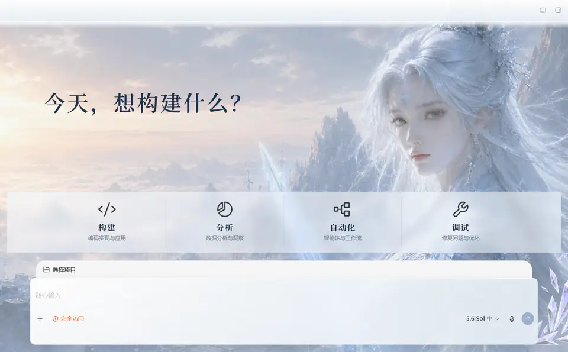
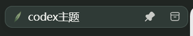
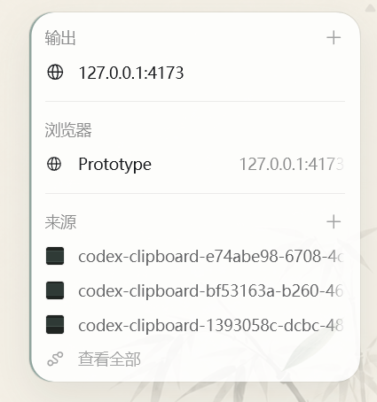

# 主题与功能图鉴

本文记录当前仓库已经实现的主题、界面能力，以及以后生成新主题时需要覆盖的位置。截图均来自 Codex Desktop 运行效果或基于最终运行画面的隐私安全局部展示，不包含账户、项目或对话隐私。

## 内置主题

### 墨境 `ink-landscape`


墨境以宣纸、水墨山水和低饱和玉色为核心。首页与对话页使用不同构图；侧栏拥有独立墨色纹理；当前任务使用稳定的叶片标记；输入框边缘使用透明毛笔笔触作为前景装饰。

### 雪魄剑仙 `frost-sword-immortal`



雪魄剑仙使用冰雪蓝全局画布、冷色场景侧栏、半透明内容表面、冰剑选中标记与晶体前景装饰。晶体锚定在输入框右下角，保持原始比例，不会随着输入框变宽或多行增高而拉伸；原生模型、麦克风和提交/停止控件保持在装饰层上方。

## 新增界面能力

### 1. 可扩展的多主题切换

- 运行时读取 `theme-catalog.json`，主题数量不写死为两套。
- 侧栏调色盘可以即时切换已登记主题，无需重启 Codex。
- 当前主题会持久保存，并在后续任务或重新启动主题运行时后恢复。
- 资源加载失败时回滚到上一套主题，不留下半切换状态。
- 支持键盘操作和窄窗口布局，不覆盖 Codex 原生导航。

### 2. 输入框前景装饰

- 每套主题可以提供独立的透明 `composer-edge.png`。
- 清单支持左/中/右、上/中/下锚点、最大高度和透明度。
- 素材按比例渲染，不随输入框宽高变化拉伸。
- 装饰层不接收鼠标事件，原生输入、附件、模型、麦克风和提交/停止按钮仍可操作。
- 已覆盖单行、多行、文件变更摘要和运行中停止状态。

### 3. 稳定的当前任务标记



- 选中标记贴在任务标题前，而不是贴在整行最左侧。
- 置顶、归档图标出现或消失时，标题与标记不会错位。
- DOM 更新时保留有效标记，不重复移除和插入，因此不会闪烁。
- 边框、背景和标记都由主题定义；共享运行时只负责稳定挂载。

### 4. 输出面板统一表面



- 输出面板外壳、标题、端口、浏览器和来源列表使用同一套表面语言。
- 修复外层背景与内部粘性标题出现白色、米黄混杂的问题。
- 保留 URL、展开器、来源缩略图、添加按钮和“查看全部”等原生交互。
- 面板圆角会裁切背景素材，半透明表面仍能透出主题氛围。

### 5. 全局与弹出层适配

- 对话背景覆盖完整主画布和右侧空白区域，并兼容圆角与滚动边缘。
- 文件变更摘要和输入框周围的原生渐变轨道被统一处理，不再出现白色横条或侧轨。
- 用量卡片、菜单、弹窗和浮层使用独立的可读性规则，避免浅色文字落在白色卡片上。
- 进度状态只对小面积元素使用轻量动画，并为 `prefers-reduced-motion` 提供降级。

### 6. “万象”桌面启动面板

- Codex 已运行时，先显示带万象图标的重启确认面板，并突出提醒保存未发送内容。
- Codex 未运行时直接进入启动进度，不显示多余的冷启动消息框。
- 清理旧会话、运行环境检查、安全端口分配、Codex 启动、调试端点连接、主题注入和最终验证会实时汇报各自进度。
- 进度轨道即时绘制，不使用与实际状态无关的循环动画；只有主题验证成功后才显示 100% 并自动收起。
- 完成状态只说明“主题已加载，Codex 即将显示”，不再重复提示下次点击快捷方式。
- 启动失败时显示错误摘要和诊断日志位置，仍不强制关闭未经核验的进程。

## 新主题需要实现的位置

每个新主题都沿用同一结构，不复制某一种视觉风格。至少需要检查以下十类界面：

1. 全局画布：主背景、标题栏过渡、滚动边缘和完整高度覆盖。
2. 侧栏：普通、悬停、焦点、当前任务、项目列表与账户区。
3. 首页：主视觉、安全文字区、四个功能入口、项目选择和初始输入框。
4. 对话：正文、链接、代码、差异、工具结果、图片与长内容可读性。
5. 进度和文件变更：进度指示、文件变更摘要及其背景轨道。
6. 输入框：单行、多行、附件、权限、模型、麦克风、提交与停止状态。
7. 当前任务：主题标记、标题、置顶/归档操作和无闪烁更新。
8. 输出面板：端口、浏览器、来源、缩略图、展开器和统一表面。
9. 弹出层：用量卡、菜单、对话框、提示和禁用状态对比度。
10. 主题切换器：入口、主题列表、当前状态、键盘、持久化、失败回滚和窄窗口。

对应的字段、资源限制、实现边界和验收清单见：

- [`new-theme-blueprint.md`](../skills/codex-theme-builder/references/new-theme-blueprint.md)
- [`theme-contract.md`](../skills/codex-theme-builder/references/theme-contract.md)
- [`qa-checklist.md`](../skills/codex-theme-builder/references/qa-checklist.md)

## 主题包结构

```text
assets/themes/<theme-id>/
├─ theme.json
├─ theme.css
├─ background.webp
├─ conversation-background.webp
├─ sidebar-background.webp      # 可选
├─ selected-marker.png          # 可选
├─ composer-edge.png            # 可选
├─ icon-build.svg
├─ icon-analyze.svg
├─ icon-automate.svg
└─ icon-debug.svg
```

新增主题时只把视觉身份放进主题目录；DOM 探测、资源校验、标记稳定性、主题切换和失败回滚继续由共享运行时负责。
